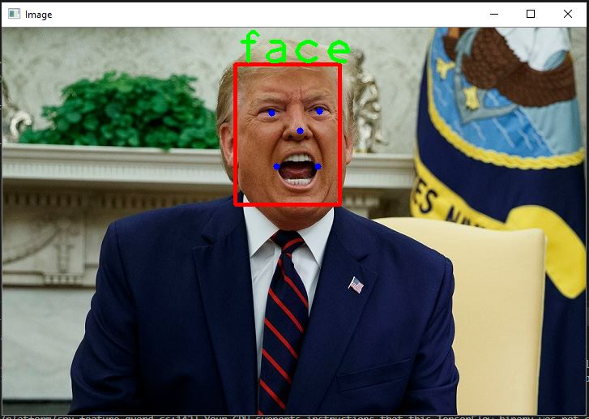
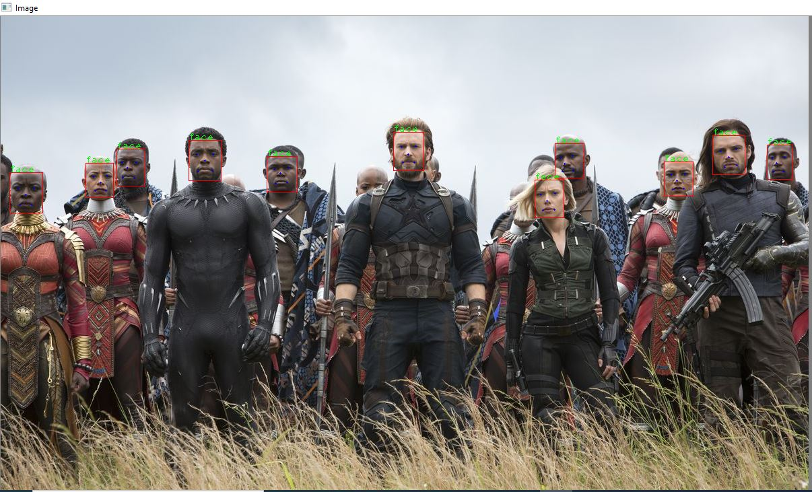

# Face Recognition using MTCNN and OpenCV
###### (Under Development)


### Installing

Clone the repositroy

```
git clone https://github.com/Hasan-75/Face-Recognition.git
```

Install **MTCNN** and **Tensorflow**

```
pip install mtcnn
pip install tensorflow
```
Create a 
End with an example of getting some data out of the system or using it for a little demo


### Previews

<p>&nbsp;</p>


<p>&nbsp;</p>


